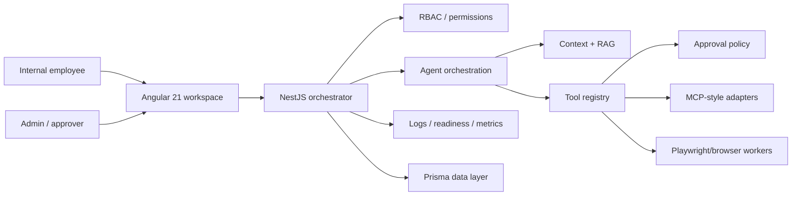
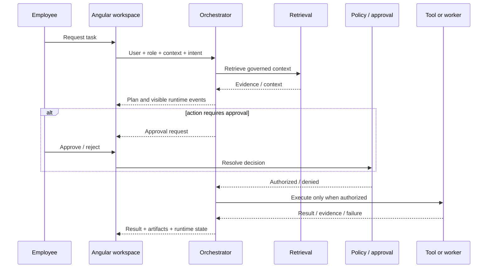

# Architecture Review — Org AI Force

`org-ai-force` is the **enterprise AI workspace architecture proof** in the portfolio: an Angular operator surface backed by a NestJS orchestration layer, governed tools, retrieval, browser workers, pilot operations and observability.

## System context

## Enterprise runtime flow

## Trust boundaries

### Browser

- renders agent state, plans, artifacts, citations and approval surfaces
- must not be the final authority for authorization or tool policy
- should receive only user-appropriate operational data

### Orchestration/API layer

- validates identity and permissions
- controls agent/tool access
- owns policy and approval enforcement
- coordinates RAG, tool adapters, browser workers and audit events

### External/worker layer

- potentially higher-risk execution surface
- requires scoped inputs, timeouts, validation, auditability and explicit production configuration

## Failure architecture

| Failure | Expected architecture behavior |
| --- | --- |
| Model/provider unavailable | Degrade to explicit failed/retryable runtime state |
| Retrieval unavailable | Do not manufacture evidence; distinguish ungrounded responses |
| Tool denied | Preserve denial/rejection as an auditable terminal event |
| Browser worker timeout | Cancel/timeout safely and return evidence of failure |
| Duplicate action | Production executor should use idempotency/deduplication |
| Permission drift | Re-authorize protected work at execution time, not only at page load |
| Pilot degradation | Surface readiness/ops signals rather than hiding unhealthy dependencies |

## Implemented vs demo vs planned

The repository already distinguishes implemented, mock/demo-safe and planned work. Preserve that boundary as a release requirement. A recruiter or contributor should be able to tell whether a visible feature is a real integration, a deterministic demonstration, or an architectural target.

## Architect review checklist

- [ ] Roles and permissions are enforced server-side for protected operations.
- [ ] Agent orchestration is separated from UI rendering.
- [ ] Retrieval evidence is inspectable.
- [ ] Tools have explicit governance and approval boundaries.
- [ ] Browser automation is treated as an execution worker, not a trusted UI shortcut.
- [ ] Ops/readiness surfaces expose degraded states.
- [ ] Production claims are backed by implementation and validation.

## Portfolio role

- [`ngx-copilot-platform`](https://github.com/AnkitParekh007/ngx-copilot-platform): application-grade Angular copilot platform.
- [`frontend-ai-patterns`](https://github.com/AnkitParekh007/frontend-ai-patterns): reusable frontend trust patterns.
- [`agent-studio`](https://github.com/AnkitParekh007/agent-studio): managed-agent application factory and lifecycle control plane.
